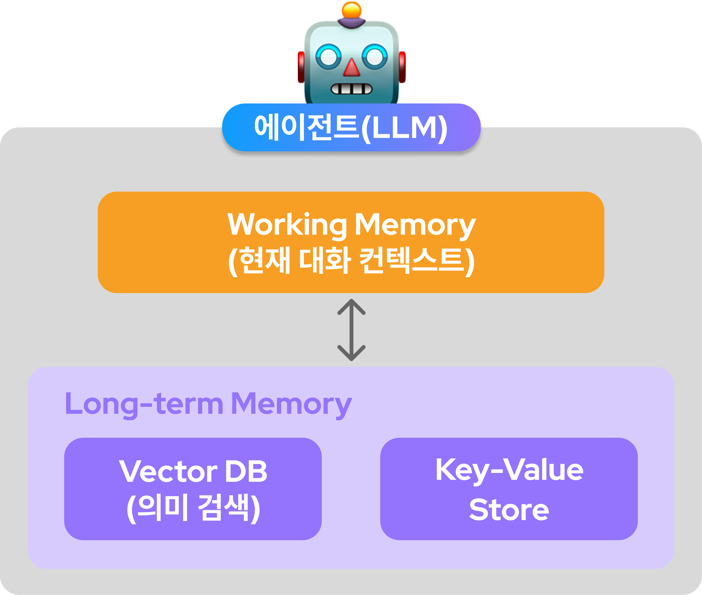

<!-- _class: cover -->
<!-- _paginate: false -->
<!-- _footer: "" -->

# Agentic AI

## 1차시: 싱글 에이전트

LangChain 기반 AI 에이전트 구축

<!--
[IMAGE] images/cover.png
표지 이미지: AI 에이전트 컨셉 일러스트 (뇌+톱니바퀴 또는 로봇이 도구 사용하는 이미지)
-->

---

# 목차

<div class="columns">
<div>

### Part 1: 개념 및 도구

1. Agentic AI란?
2. LangChain & 싱글 에이전트 아키텍처

</div>
<div>

### Part 2: 구성요소

3. Planning & CoT (계획 + 추론)
4. Tool Use (실행)
5. 메모리 & RAG (기억 + 지식)
6. Self-Reflection (평가)

</div>
</div>

### Part 3: 통합 실습

7. LangGraph 통합 에이전트

---

<!-- _class: section-divider -->
<!-- _paginate: false -->
<!-- _footer: "" -->

# 01

## Agentic AI란?

---

# Agentic AI 정의

*자율적으로 목표를 달성*하기 위해 행동하는 AI 시스템

- 단순 응답이 아닌 _계획-실행-평가_ 사이클 수행
- 외부 도구와 상호작용하여 실제 작업 수행
- 환경 변화에 적응하며 동적으로 전략 수정

---

# 기존 LLM vs Agentic AI

|     구분      |      기존 LLM      |     Agentic AI     |
| :-----------: | :----------------: | :----------------: |
| **작업 방식** |   단일 응답 생성   |  다단계 작업 수행  |
|   **지식**    | 정적 (학습 데이터) | 동적 (실시간 검색) |
| **상호작용**  |     수동적 Q&A     |  능동적 문제 해결  |
| **도구 활용** |       불가능       | API, DB, 코드 실행 |
| **자기 개선** |        없음        |  Self-Reflection   |

---

<!-- _class: center -->

# Agentic AI의 4대 구성요소


---

<!-- _class: section-divider -->
<!-- _paginate: false -->
<!-- _footer: "" -->

# 02

## LangChain & 싱글 에이전트 아키텍처

---

# LangChain이란?

LLM 기반 애플리케이션 개발을 위한 _오픈소스 프레임워크_

<div class="columns">
<div>

### 특징

- 컴포넌트를 _체인(Chain)_ 형태로 연결
- 에이전트, 메모리, 툴 추상화 제공
- 다양한 LLM 벤더 지원

</div>
<div>

### 구성요소

- **Models**: LLM 연동
- **Prompts**: 템플릿 관리
- **Chains**: 컴포넌트 연결
- **Agent**: 자율적 의사결정
- **Memory**: 컨텍스트 관리

</div>
</div>

---

# Conda 설치

<div class="columns">
<div>

### Windows

1. [Miniconda 다운로드](https://docs.conda.io/en/latest/miniconda.html)
2. 설치 파일 실행
3. "Add to PATH" 체크

### macOS

```bash
brew install miniconda
```

</div>
<div>

### Linux

```bash
wget https://repo.anaconda.com/miniconda/Miniconda3-latest-Linux-x86_64.sh
bash Miniconda3-latest-Linux-x86_64.sh
source ~/.bashrc
```

### 설치 확인

```bash
conda --version
```

</div>
</div>

---

# 개발 환경 설정

```bash
# 1. Conda 환경 생성
conda create -n agentic-ai python=3.13 -y

# 2. 환경 활성화
conda activate agentic-ai

# 3. 필수 패키지 설치
pip install langchain langchain-core langchain-openai langchain-community \
    langchain-text-splitters langgraph chromadb
```

---

# OpenAI API 키 발급

### 발급 절차

1. [OpenAI Platform](https://platform.openai.com) 접속 및 로그인
2. 우측 상단 프로필 → **API keys** 클릭
3. **Create new secret key** 버튼 클릭
4. 키 이름 입력 후 생성 → _키 복사 (한 번만 표시됨!)_

### 환경 변수 설정

```bash
# macOS/Linux
export OPENAI_API_KEY="sk-..."

# Windows (PowerShell)
$env:OPENAI_API_KEY="sk-..."
```

---

# LangChain 기본 사용법

```python
# 설치
pip install langchain langchain-core langchain-openai langchain-community langchain-text-splitters langgraph chromadb

# 기본 설정
from langchain_openai import ChatOpenAI

llm = ChatOpenAI(
    model="gpt-4o",
    temperature=0.7,
    api_key="your-api-key"
)

# 간단한 호출
response = llm.invoke("안녕하세요!")
print(response.content)
```

---

# 싱글 에이전트 아키텍처

<!-- _class: center -->


---

<!-- _class: section-divider -->
<!-- _paginate: false -->
<!-- _footer: "" -->

# 03

## Planning & CoT (계획과 추론)

---

# Planning이란?

복잡한 목표를 *작은 하위 작업으로 분해*하는 능력

- 큰 작업을 실행 가능한 단위로 분해 (Task Decomposition)
- 중간 목표 설정으로 진행 상황 추적 (Subgoal Setting)
- 작업 간 의존성 고려하여 실행 순서 결정 (Ordering)

---

# Planning 예시

> "서울 날씨를 확인하고, 비가 오면 실내 데이트 코스를 추천해줘"

### 에이전트가 생성한 계획

```
1. 서울 현재 날씨 API 호출
2. 날씨 상태 분석 (비 여부 확인)
3. 조건 분기:
   └─ 비 O → 실내 장소 검색
   └─ 비 X → 야외 장소 검색
4. 장소 정보 정리 및 추천 생성
5. 사용자에게 응답 반환
```

---

# Planning 구현

```python
from langchain_core.prompts import ChatPromptTemplate

planning_prompt = ChatPromptTemplate.from_messages([
    ("system", """당신은 작업 계획을 수립하는 AI입니다.
    사용자의 요청을 분석하여 단계별 실행 계획을 세우세요.

    출력 형식:
    1. [단계 1 설명]
    2. [단계 2 설명]
    ..."""),
    ("human", "{task}")
])

planning_chain = planning_prompt | llm
plan = planning_chain.invoke({"task": "최신 AI 논문을 찾아 요약해줘"})
```

---

# Chain of Thought (CoT)

LLM이 *단계별로 추론*하도록 유도하는 프롬프팅 기법

> "Let's think step by step"

### 비교

| 직접 답변        | Chain of Thought                  |
| ---------------- | --------------------------------- |
| 질문 → 답변      | 질문 → 추론1 → 추론2 → ... → 답변 |
| 오류 가능성 높음 | _추론 과정 검증 가능_             |

---

# CoT 예시

> 가게에 사과 23개가 있고, 7개를 팔고 15개를 더 받았다면?

<div class="columns">
<div>

### 직접 답변

```
답: 31개
(틀릴 수 있음)
```

</div>
<div>

### CoT 답변

```
1. 초기 사과: 23개
2. 7개 판매: 23 - 7 = 16개
3. 15개 추가: 16 + 15 = 31개

답: 31개 ✓
```

</div>
</div>

---

# CoT 프롬프트 구현

```python
cot_prompt = ChatPromptTemplate.from_messages([
    ("system", """당신은 논리적으로 사고하는 AI입니다.
    문제를 해결할 때 다음 단계를 따르세요:

    1. 문제 이해: 주어진 정보 정리
    2. 계획 수립: 해결 방법 구상
    3. 단계별 실행: 각 단계를 명시적으로 수행
    4. 검증: 답이 맞는지 확인
    5. 최종 답변: 결론 제시"""),
    ("human", "{question}")
])

cot_chain = cot_prompt | llm
```

---

<!-- _class: section-divider -->
<!-- _paginate: false -->
<!-- _footer: "" -->

# 04

## Tool Use (도구 사용)

---

# Tool Use란?

에이전트가 *외부 도구/API*를 호출하여 기능을 확장하는 능력

- LLM만으로는 불가능한 작업 수행 (검색, 계산, 파일 처리 등)
- 실시간 정보 접근 및 외부 시스템 연동
- 에이전트 능력 확장의 기반

---

# 도구의 종류

|   유형   | 설명        | 예시             |
| :------: | ----------- | ---------------- |
| **검색** | 정보 조회   | 웹 검색, DB 쿼리 |
| **계산** | 연산 수행   | 수학, 코드 실행  |
| **파일** | 데이터 처리 | 읽기, 쓰기, 분석 |
| **API**  | 외부 연동   | REST, GraphQL    |
| **실행** | 코드 수행   | Python, SQL      |

---

# 툴 정의 방법

```python
from langchain_core.tools import tool

@tool
def search_weather(city: str) -> str:
    """도시의 현재 날씨를 검색합니다."""
    # 실제로는 날씨 API 호출
    return f"{city}의 날씨: 맑음, 20°C"

@tool
def calculate(expression: str) -> str:
    """수학 표현식을 계산합니다."""
    try:
        result = eval(expression)
        return f"결과: {result}"
    except Exception:
        return "계산 오류"

tools = [search_weather, calculate]
```

---

# 에이전트에 툴 연결 (LangGraph)

```python
from langgraph.prebuilt import create_react_agent

# ReAct 에이전트 생성 (LangGraph 방식)
agent = create_react_agent(llm, tools)

# 실행 - 자동으로 적절한 도구 선택 및 호출
result = agent.invoke({
    "messages": [("user", "서울 날씨 알려주고, 234 * 567 계산해줘")]
})

print(result["messages"][-1].content)
```

---

<!-- _class: section-divider -->
<!-- _paginate: false -->
<!-- _footer: "" -->

# 05

## 메모리 & RAG (기억과 지식)

---

# 메모리가 필요한 이유

LLM은 기본적으로 _상태가 없음_ (Stateless)

- 매 요청마다 이전 대화 내용을 기억하지 못함
- 사용자 선호도나 과거 작업 결과 활용 불가
- 연속적이고 맥락 있는 대화가 어려움

> 메모리로 **맥락 유지**, **개인화**, **학습** 구현

---

# 메모리의 종류

|     유형     | 설명               | 예시           |
| :----------: | ------------------ | -------------- |
|   **단기**   | 현재 대화 컨텍스트 | 이전 메시지들  |
|   **장기**   | 영구 저장 정보     | 사용자 선호도  |
| **에피소드** | 특정 이벤트 기억   | 과거 작업 결과 |
|   **의미**   | 일반 지식          | 학습된 사실들  |

---

<!-- _class: center -->

# 메모리 아키텍처



---

# 메모리 구현

```python
from langgraph.checkpoint.memory import MemorySaver
from langgraph.prebuilt import create_react_agent

# 메모리 체크포인터 생성
memory = MemorySaver()

# 메모리가 있는 에이전트 생성
agent = create_react_agent(llm, tools, checkpointer=memory)

# 세션 ID로 대화 컨텍스트 유지
config = {"configurable": {"thread_id": "user-123"}}

agent.invoke({"messages": [("user", "내 이름은 철수야")]}, config)
agent.invoke({"messages": [("user", "내 이름이 뭐라고 했지?")]}, config)
# → "철수라고 하셨습니다"
```

---

# 다양한 메모리 전략

```python
# 1. 인메모리 (개발/테스트용)
from langgraph.checkpoint.memory import MemorySaver
memory = MemorySaver()

# 2. SQLite 영구 저장
from langgraph.checkpoint.sqlite import SqliteSaver
memory = SqliteSaver.from_conn_string("checkpoints.db")

# 3. PostgreSQL (프로덕션용)
from langgraph.checkpoint.postgres import PostgresSaver
memory = PostgresSaver.from_conn_string(DB_URI)
```

---

# RAG란?

_검색(Retrieval)_ + _생성(Generation)_ 결합

- 외부 문서에서 관련 정보를 검색하여 LLM에 제공
- LLM이 검색된 컨텍스트를 기반으로 답변 생성
- 학습 데이터에 없는 최신/도메인 지식 활용 가능

> 파이프라인: 질문 → 문서 검색 → 컨텍스트 + LLM → 답변

---

# RAG의 장점

- **환각 감소**: 실제 문서 기반 답변으로 신뢰성 향상
- **최신 정보**: 학습 이후 데이터도 활용 가능
- **도메인 특화**: 사내 문서, 전문 지식 등 커스텀 지식 활용

---

<!-- _class: center -->

# RAG 아키텍처


---

# RAG 구현 - 문서 인덱싱

```python
from langchain_community.document_loaders import TextLoader
from langchain_text_splitters import RecursiveCharacterTextSplitter
from langchain_openai import OpenAIEmbeddings
from langchain_community.vectorstores import Chroma

# 1. 문서 로드
loader = TextLoader("knowledge_base.txt")
documents = loader.load()

# 2. 청크 분할
splitter = RecursiveCharacterTextSplitter(
    chunk_size=1000, chunk_overlap=200
)
chunks = splitter.split_documents(documents)

# 3. 벡터 저장소 생성
vectorstore = Chroma.from_documents(chunks, OpenAIEmbeddings())
```

---

# RAG 구현 - 검색 및 생성

```python
from langchain_core.prompts import ChatPromptTemplate
from langchain_core.runnables import RunnablePassthrough

# 검색기 설정
retriever = vectorstore.as_retriever(search_kwargs={"k": 3})

# RAG 프롬프트
rag_prompt = ChatPromptTemplate.from_messages([
    ("system", """다음 컨텍스트를 참고하여 질문에 답하세요.
    컨텍스트에 없는 내용은 "모르겠습니다"라고 답하세요.

    컨텍스트: {context}"""),
    ("human", "{question}")
])

# RAG 체인
rag_chain = (
    {"context": retriever, "question": RunnablePassthrough()}
    | rag_prompt | llm
)
```

---

<!-- _class: section-divider -->
<!-- _paginate: false -->
<!-- _footer: "" -->

# 06

## Self-Reflection (자기 평가)

---

# Self-Reflection이란?

에이전트가 *자신의 출력을 평가*하고 개선하는 능력

<div class="columns">
<div>

### 프로세스


</div>
<div>

### 적용 사례

- 코드 생성 후 버그 검토
- 답변의 정확성 검증
- 논리적 일관성 확인
- 품질 기준 충족 여부

</div>
</div>

---

<!-- _class: center -->

# Self-Reflection 패턴


---

# Self-Reflection 구현

```python
reflection_prompt = ChatPromptTemplate.from_messages([
    ("system", """당신은 AI 응답을 평가하는 비평가입니다.
    다음 기준으로 응답을 평가하세요:
    1. 정확성: 사실에 기반한가?
    2. 완전성: 질문에 충분히 답했는가?
    3. 명확성: 이해하기 쉬운가?

    점수 (1-10)와 개선 제안을 제공하세요."""),
    ("human", "원본 질문: {question}\n응답: {response}")
])

def reflect_and_improve(question, response):
    critique = (reflection_prompt | llm).invoke({
        "question": question, "response": response
    })
    return critique
```

---

# Reflexion 프레임워크

```python
MAX_ITERATIONS = 3

def reflexion_loop(task):
    response = generate_initial_response(task)

    for i in range(MAX_ITERATIONS):
        evaluation = evaluate_response(response)

        if evaluation.score >= 8:  # 품질 기준 충족
            return response

        # 피드백을 반영하여 재생성
        response = improve_response(
            task, response, evaluation.feedback
        )

    return response  # 최대 반복 후 최선의 결과 반환
```

---

<!-- _class: section-divider -->
<!-- _paginate: false -->
<!-- _footer: "" -->

# 07

## LangGraph 통합 실습

---

# LangGraph 에이전트 상태 정의

```python
from langgraph.graph import StateGraph, END
from typing import TypedDict

class AgentState(TypedDict):
    task: str
    plan: list[str]
    current_step: int
    results: list[str]
    final_answer: str

def planner(state: AgentState) -> AgentState:
    """작업 계획 수립"""
    plan = planning_chain.invoke({"task": state["task"]})
    return {"plan": parse_plan(plan), "current_step": 0}

def executor(state: AgentState) -> AgentState:
    """현재 단계 실행"""
    step = state["plan"][state["current_step"]]
    result = execute_step(step)
    return {"results": state["results"] + [result]}
```

---

# LangGraph 워크플로우 구성

<!--
[IMAGE] images/langgraph-workflow.png
START → Planner → Executor → Reflector → 조건부 분기 → END or Loop
-->

```python
def reflector(state: AgentState) -> AgentState:
    """결과 검증 및 평가"""
    evaluation = reflection_chain.invoke({
        "task": state["task"], "results": state["results"]
    })
    return {"evaluation": evaluation}

# 그래프 구성
workflow = StateGraph(AgentState)
workflow.add_node("planner", planner)
workflow.add_node("executor", executor)
workflow.add_node("reflector", reflector)

workflow.set_entry_point("planner")
workflow.add_edge("planner", "executor")
workflow.add_edge("executor", "reflector")

agent = workflow.compile()
```

---

# 정리

|    구성요소    | 역할              | LangChain 구현     |
| :------------: | ----------------- | ------------------ |
|  **Planning**  | 작업 분해 및 계획 | Prompt Engineering |
| **Reflection** | 자가 평가 및 개선 | Critique Chain     |
|   **메모리**   | 컨텍스트 유지     | Memory Classes     |
|  **Tool Use**  | 외부 기능 확장    | Tools, 에이전트    |
|    **CoT**     | 단계별 추론       | Prompt Design      |
|    **RAG**     | 외부 지식 활용    | Retriever + LLM    |

---

# 다음 차시 예고

## 2차시: Multi-Agent 시스템 (AutoGen)

- AutoGen 프레임워크 소개
- 에이전트 간 협업 및 대화 패턴
- GroupChat / Supervisor 구조
- 실전 프로젝트: 협업 기반 문제 해결 시스템

---

# 참고 자료

### 공식 문서

- **LangChain**: https://python.langchain.com
- **LangGraph**: https://langchain-ai.github.io/langgraph

### 주요 논문

- _ReAct_: Synergizing Reasoning and Acting in Language Models
- _Reflexion_: Language Agents with Verbal Reinforcement Learning
- _Chain-of-Thought_: Prompting Elicits Reasoning in LLMs

---

# Q&A

<!-- _class: center -->


---

<!-- _class: closing -->
<!-- _paginate: false -->
<!-- _footer: "" -->

# 감사합니다

**1차시: 싱글 에이전트** 완료
